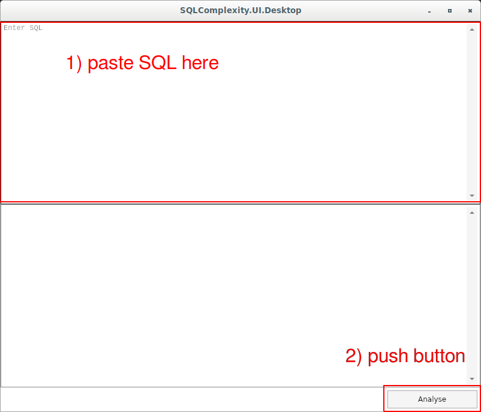
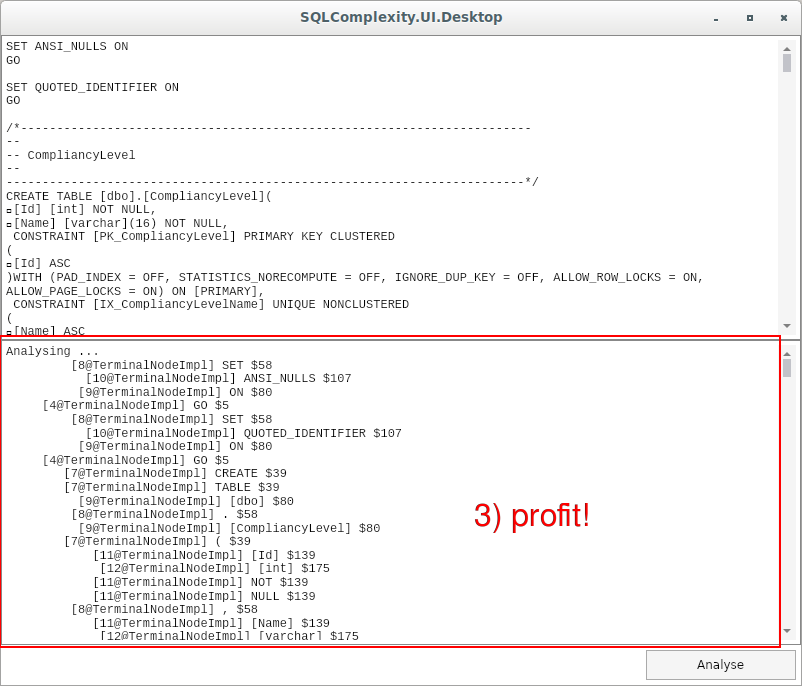
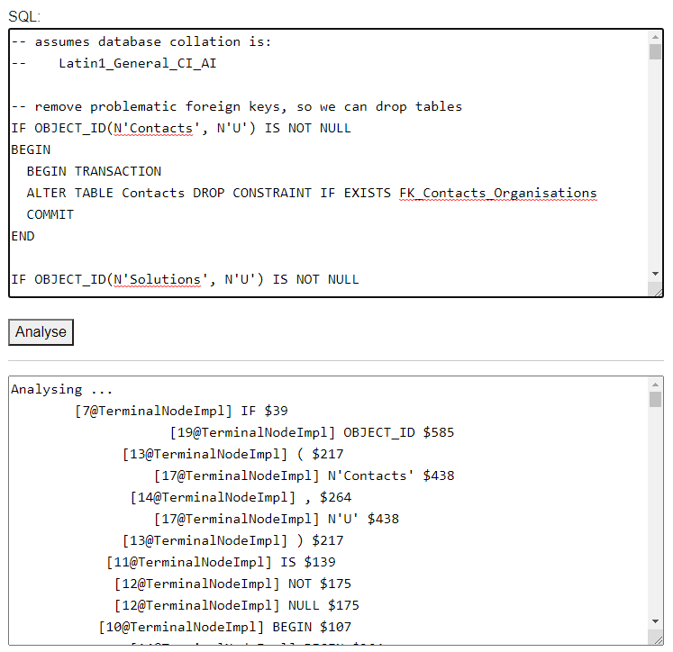

# SQL Complexity based on Abstract Syntax Tree density

## Description
A novel way to identify _complexity_ in your SQL queries by analysing the _abstract syntax tree_

## User Interfaces

### Desktop
A cross-platform desktop client is provided:

    SQLCompexity.UI.Desktop

which should run on:
* Windows
* Linux
* MacOS





### Web
A webassembly version is provided:



which should run on all major browsers

### Commandline
A cross-platform desktop client is provided:

    SQLCompexity.UI.CLI [path_to_sql_file]

which should run on:
* Windows
* Linux
* MacOS

## API
To allow integration into third party products, there is an exposed API at:

    ./SQLComplexity/Analyser.cs

## Building
```
git clone https://github.com/TrevorDArcyEvans/SQLComplexity.git --recursive
cd SQLComplexity
dotnet restore
dotnet build
```

## Further Work
* review how node weight increases with depth
  * this is currently an exponential increase
* review `Weightings.csv` data file for the _cost_ (aka _complexity_) of each _operation_
  * virtually all _operations_ are currently set to a _cost_ of $1 
* support more SQL _operations_

## Background
Based on ANTLR TSQL parser/lexer from:  
https://github.com/JaCraig/SQLParser

and TSQL grammar from:  
https://github.com/antlr/grammars-v4/tree/master/tsql

Abstract Syntax Tree (AST):  
https://en.wikipedia.org/wiki/Abstract_syntax_tree

Entropy of an AST:  
https://medium.com/mindsoft/abstract-syntax-tree-entropy-e2047af4906f

Matching Source Code Using Abstract Syntax Trees in Version Control Systems:  
https://m.scirp.org/papers/85733
